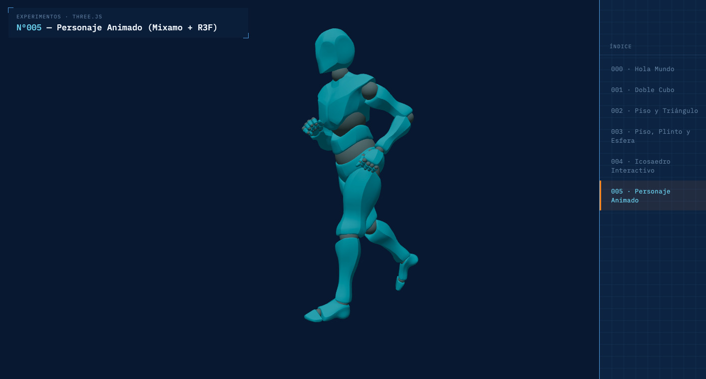

# Experimentos Three.js

Repositorio de experimentación y aprendizaje progresivo con [Three.js](https://threejs.org/), orientado a explorar de forma metódica los fundamentos de gráficos 3D en la web —desde la escena, la cámara y el ciclo de renderizado, hasta patrones más avanzados como animaciones esqueléticas y arquitecturas declarativas con React Three Fiber. Cada experimento se numera y documenta de forma incremental, construyendo sobre los conceptos del anterior.

🔗 **Demo en vivo:** https://german-rs.github.io/experimentos-threejs/

## Vista previa



*Experimento 005: personaje de Mixamo animado con React Three Fiber, corrección de escala cm → m.*


## Stack

- [Three.js](https://threejs.org/) — librería de gráficos 3D con WebGL
- [Vite](https://vitejs.dev/) — bundler y servidor de desarrollo
- [React](https://react.dev/) — UI compartida (navegación, título) y, desde el Experimento 004, también la propia escena 3D vía React Three Fiber
- [React Three Fiber](https://r3f.docs.pmnd.rs/) + [Drei](https://github.com/pmndrs/drei) — usado en el Experimento 004 en adelante: escenas declarativas (`<Canvas>`, `useFrame`), interactividad (eventos de puntero), y carga de modelos animados (`useGLTF`, `useAnimations`)
- JavaScript / JSX

## Arquitectura

Este repositorio combina dos enfoques de forma deliberada, para comparar en la práctica el modelo imperativo de Three.js vanilla con el modelo declarativo de React Three Fiber:

- **Experimentos 000–003 — Three.js vanilla + React aislado**: cada experimento tiene su propio `main.js` con la lógica 3D (escena, cámara, geometrías, animación), completamente independiente de React. La barra de navegación (`src/components/Nav.jsx`) se monta aparte mediante un archivo `main-nav-00X.jsx`; Three.js y React no se comunican entre sí.
- **Experimentos 004 en adelante — React Three Fiber (R3F)**: la escena 3D se construye de forma declarativa con `@react-three/fiber` y `@react-three/drei`. Un único `main.jsx` monta la navegación, el título y la escena 3D en sus respectivas raíces de React, eliminando la separación entre "mundo Three.js" y "mundo React" que tenían los experimentos anteriores.
- **Multi-página con Vite**: cada experimento es una página HTML independiente, registrada en `vite.config.js` (`build.rollupOptions.input`), no una sola SPA con rutas de cliente.
- **Rutas dinámicas con `import.meta.env.BASE_URL`**: tanto los enlaces de navegación como las rutas a assets estáticos (modelos `.glb`, texturas) se generan usando esta variable, para que funcionen igual en desarrollo local y en GitHub Pages (donde el sitio vive bajo `/experimentos-threejs/`).
- **Sistema de diseño**: paleta y tipografía "blueprint" (IBM Plex Mono/Sans) definida en `src/styles/` con Sass — tokens en `_tokens.scss` (CSS custom properties), patrones reutilizables en `_mixins.scss` (breakpoint móvil, marcas de esquina), compilado en un único `main.scss` compartido por todas las páginas. Los mismos tokens de color se exponen a Three.js/R3F mediante `src/theme.js` (`getToken()`), manteniendo un único origen de verdad para la paleta entre CSS y las escenas 3D.

### Cómo agregar un experimento nuevo

**Si es un experimento vanilla (estilo 000–003):**
1. Crear `experimentos/00X-nombre/` con su `index.html` y `main.js` (lógica Three.js)
2. Crear `src/main-nav-00X.jsx` (copiar uno existente y cambiar el valor de `activo`)
3. Agregar una fila al array `experimentos` dentro de `src/components/Nav.jsx`
4. Registrar el nuevo `index.html` en `vite.config.js` → `build.rollupOptions.input`

**Si es un experimento con React Three Fiber (estilo 004 en adelante):**
1. Crear `experimentos/00X-nombre/` con `index.html`, `main.jsx`, `Escena.jsx` y los componentes 3D que correspondan (ej. `Personaje.jsx`)
2. `main.jsx` monta `Nav`, `Titulo` y `Escena` directamente — no hace falta un `main-nav-00X.jsx` aparte
3. Agregar una fila al array `experimentos` dentro de `src/components/Nav.jsx`
4. Registrar el nuevo `index.html` en `vite.config.js` → `build.rollupOptions.input`

## Experimentos

| # | Nombre | Descripción | Estado |
|---|--------|-------------|--------|
| 000 | Hola Mundo | Cubo girando con luz direccional, cámara y loop de animación básico | ✅ |
| 001 | Doble cubo | Segundo cubo de otro color, girando de forma independiente | ✅ |
| 002 | Piso y triángulo | Piso con `PlaneGeometry`, triángulo con `ShapeGeometry` girando sobre él | ✅ |
| 003 | Piso, plinto y esfera | Composición tipo museo: piso, plinto con `CylinderGeometry` y esfera con sombras (`SpotLight`, shadow mapping) | ✅ |
| 004 | Icosaedro interactivo | Primer experimento con [React Three Fiber](https://r3f.docs.pmnd.rs/): icosaedro que cambia de color al clic (`useState`), `OrbitControls` de `@react-three/drei` | ✅ |
| 005 | Personaje animado | Carga de modelo Mixamo (`.glb`) con [React Three Fiber](https://r3f.docs.pmnd.rs/): `useGLTF` + `useAnimations` de `@react-three/drei`, corrección de escala (cm → m) | ✅ |

*(Esta tabla se irá actualizando a medida que se agreguen nuevos experimentos.)*

## Cómo correr el proyecto localmente

```bash
git clone https://github.com/german-rs/experimentos-threejs.git
cd experimentos-threejs
npm install
npm run dev
```

Luego abre `http://localhost:5173` en el navegador.

## Cómo generar el build de producción

```bash
npm run build
npm run preview
```

## Despliegue

El proyecto se publica en GitHub Pages mediante `gh-pages`:

```bash
npm run deploy
```

## Autor

**Germán Riveros**
🌐 [germanriveros.cl](https://germanriveros.cl)
💻 [github.com/german-rs](https://github.com/german-rs)